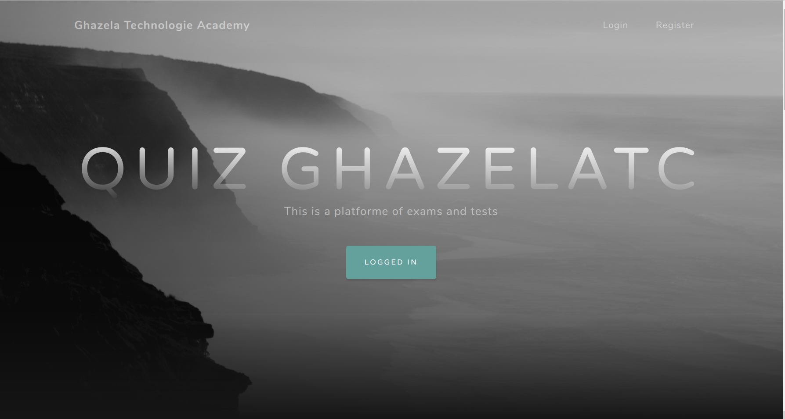
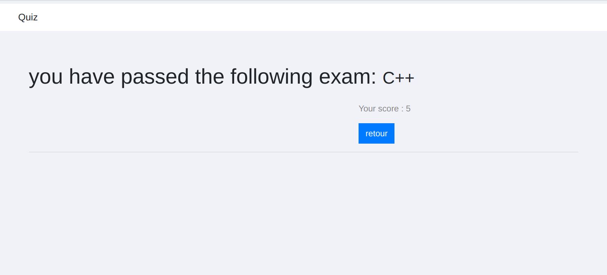

# GTA Quiz

GTA Quiz is an innovative online test platform for 'Ghazela Technology Academy' which is a Service and Computer Engineering Company (SSII) which provides professional training in IT, management and digital,Built using the Django framework.

## Installation

Setup project environment with [virtualenv](https://virtualenv.pypa.io/en/latest/) and [pip](https://pip.pypa.io/en/stable/).

```bash
$ virtualenv project-env
$ source project-env/bin/activate
$ git clone https://RhSarra@bitbucket.org/RhSarra/quizproject.git
$ cd quizproject
$ pip install -r requirements.txt
$ python manage.py runserver
```

## Preview
This is a resume of principal features in this website:
#### Home page: 


#### Authentification:


#### Login:


#### Professor:
-Create exams:

 

-Add question:

 

-List of professor exams:

 

-Consult exam:

 

-Edit exam:

 

-Invite students to pass exams:
  
     Classroom students:

   

     New students:

 
#### Student:
-List of student exams:

 

-Pass exam:

 

   There are three types of exams:
1) Training exam:




2) Exam with score:


3) Certified exam:


#### User profile:

